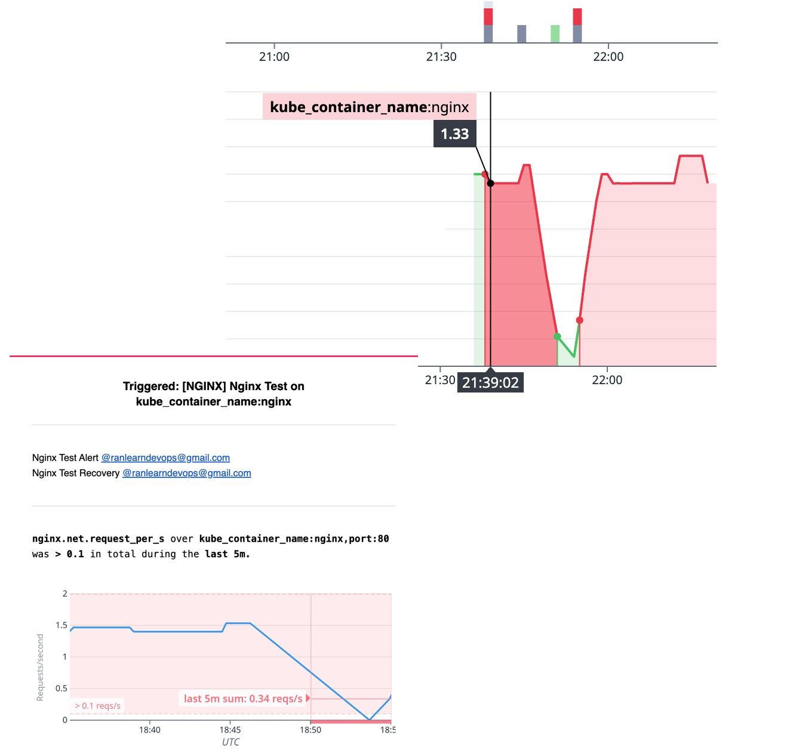

# Datadog Observability on a Local KinD Cluster

This guide walks through setting up full observability using Datadog on a local Kubernetes cluster powered by KinD. It includes:
- Creating a Datadog account and API key
- Launching a KinD cluster
- Installing the Datadog Agent via Helm
- Enabling observability on core cluster components
- Deploying an NGINX pod with auto-discovery (AD)
- Viewing metrics in the Datadog UI

---
## About Data Dog Agent:
From Datadog documentation: <br>
<i>The Datadog Agent is an open source software that runs on a host. It collects metrics and events from the host and sends them to Datadog. It can run on your local hosts (Windows, macOS), containerized environments (Docker, Kubernetes), and in on-premises data centers.</i>

Datadog agent is running as a [daemonset](https://kubernetes.io/do.cs/concepts/workloads/controllers/daemonset/) ensuring metrics are collected fron every node


With the agents help we will be able to observe dashboard from [metrics]((https://kubernetes.io/docs/reference/instrumentation/metrics/)) that are being exposed by default from various k8s compoenets. 


## 1. Create a Datadog Account & API Key

1. Go to [https://www.datadoghq.com](https://www.datadoghq.com)
2. Click **Start Free Trial** and create an account (use `us5` if you're in that region)
3. In Datadog UI, go to **Integrations > APIs**
4. Under **API Keys**, click **+ New Key**, name it (e.g. `kind-local`) and copy the key

---

## 2. Create a Local KinD Cluster

`kind create cluster --name dd-monitor`

---

## 3. Create a Helm `values.yaml` File for Datadog

Save this as `values.yaml`:

```yaml
datadog:
  apiKey: <YOUR_DATADOG_API_KEY>
  site: us5.datadoghq.com
  logs:
    enabled: true
  apm:
    enabled: true
  processAgent:
    enabled: true
  kubelet:
    # host: "host.docker.internal"
    tlsVerify: false
  tags:
    - env:kind

agents:
  containerLogs:
    enabled: true

daemonset:
  useHostPort: true

kubeScheduler:
  enabled: true
  tlsVerify: false
  leaderElection: false

clusterName: kind-dd-monitor  # Must be non-empty and unique per cluster

orchestratorExplorer:
  enabled: true
```

> Replace `<YOUR_DATADOG_API_KEY>` with your real key.

---

## 4. Install the Datadog Agent via Helm

```bash
helm repo add datadog https://helm.datadoghq.com
helm repo update
helm install datadog-agent datadog/datadog -f values.yaml
```

---

## 6. Create and Apply NGINX ConfigMap

Create `nginx.conf`:
```nginx
events {}
http {
  server {
    listen 80;
    location /nginx_status {
      stub_status;
      allow all;
    }
  }
}
```

Create ConfigMap:
```bash
kubectl apply -f Datadog/test_container/nginx-configmap.yml
```

---

## 7. Deploy NGINX Pod with AD Annotations

Create `nginx-ad.yaml`:
```yaml
apiVersion: v1
kind: Pod
metadata:
  name: nginx-ad
  labels:
    app: nginx
  annotations:
    ad.datadoghq.com/nginx.check_names: '["nginx"]'
    ad.datadoghq.com/nginx.init_configs: '[{}]'
    ad.datadoghq.com/nginx.instances: |
      [
        {"nginx_status_url": "http://%%host%%:80/nginx_status"}
      ]
spec:
  containers:
    - name: nginx
      image: nginx
      ports:
        - containerPort: 80
      volumeMounts:
        - name: nginx-config-volume
          mountPath: /etc/nginx/nginx.conf
          subPath: nginx.conf
  volumes:
    - name: nginx-config-volume
      configMap:
        name: nginx-config
```

Apply it:
```bash
kubectl apply -f nginx-ad.yaml
```

---

## 8. View Metrics in Datadog

- Go to **Datadog > Infrastructure > Containers** — NGINX should appear
- Check **Integrations > NGINX** for service-level metrics
- View **Cluster Explorer** and **Live Container View**

## 9. 🚨 Add Monitoring

- We can configure to get notified on a variety of cases regarding our service
- Integrations in Datadog allows us to configure an out-of-the-box alerts for specific cases
- I've used the a metric based monitor: `nginx.net.request_per_s` and set a very low threshold just for the demonstration purposes.
- You can see the result, an alert was triggered, and (as I configured) - it sends an email:


---

## ✅ Done!

You now have:
- A monitored KinD cluster
- Full observability on core components
- A running NGINX pod with auto-discovery
- Metrics flowing into Datadog UI

